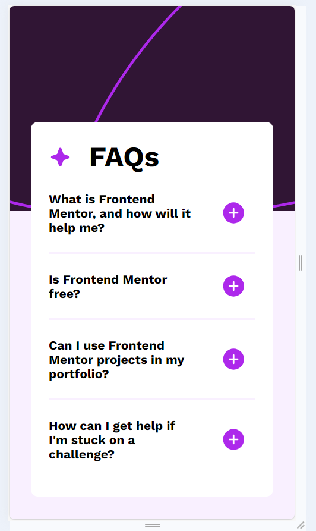
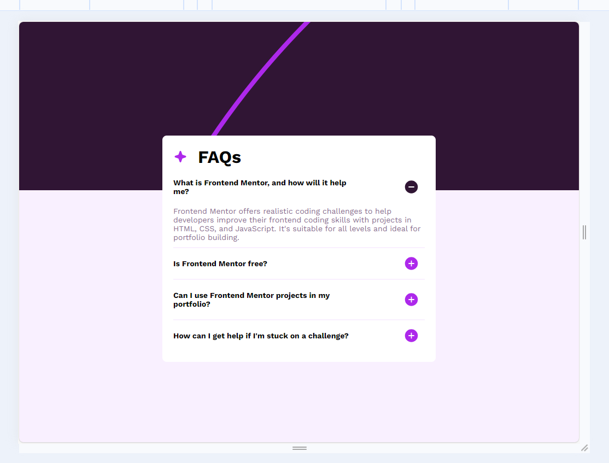

# Frontend Mentor - FAQ accordion solution

This is a solution to the [FAQ accordion challenge on Frontend Mentor](https://www.frontendmentor.io/challenges/faq-accordion-wyfFdeBwBz). Frontend Mentor challenges help you improve your coding skills by building realistic projects. 

## Table of contents

- [Overview](#overview)
  - [The challenge](#the-challenge)
  - [Screenshots](#screenshots)
  - [Links](#links)
- [My process](#my-process)
  - [Built with](#built-with)
- [Author](#author)

## Overview

### The challenge

Users should be able to:

- Hide/Show the answer to a question when the question is clicked
- Navigate the questions and hide/show answers using keyboard navigation alone
- View the optimal layout for the interface depending on their device's screen size
- See hover and focus states for all interactive elements on the page

### Screenshots

#### For mobiles

#### For tablets

### Links

- Solution URL: [Github profile](https://github.com/AlexanderEstebanZapata1994/faq-accordion)
- Live Site URL: [Hosted on Netlify](https://faq-accordion-aez.netlify.app/)

## My process

### Built with

- Semantic HTML5 markup
- CSS custom properties
- CSS Grid
- Mobile-first workflow
- [Javascript](https://www.javascript.com/) - Basic JS implementation for Accordion behavior

## Author

- Website - [Alexander Esteban Zapata](https://www.your-site.com)
- Frontend Mentor - [@AlexanderEstebanZapata1994](https://www.frontendmentor.io/profile/AlexanderEstebanZapata1994)
- Linkedin - [Follow me here](https://www.linkedin.com/in/alexander-esteban-zapata-01b87284/)
